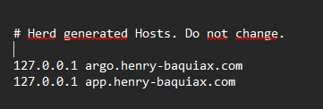
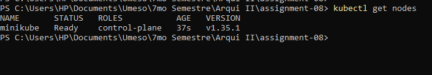
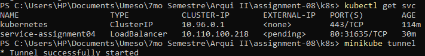
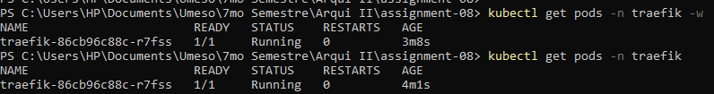
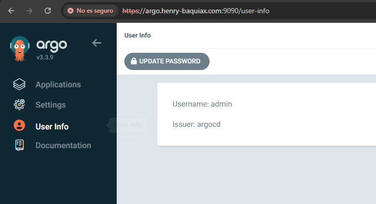

# 🚀 Assignment 08 – Kubernetes con Minikube, Traefik y ArgoCD

## 📌 Descripción

En este proyecto se implementó un clúster de Kubernetes utilizando **Minikube** en entorno Windows.
Se desplegaron los siguientes componentes:

* Aplicación dockerizada (semana 4)
* Traefik como Ingress Controller
* ArgoCD para gestión de aplicaciones (GitOps)

Toda la infraestructura fue configurada mediante **manifiestos YAML (Infraestructura como Código)**.

---

# 🌐 Configuración de DNS local

Se configuró el archivo `hosts` de Windows:

```text
C:\Windows\System32\drivers\etc\hosts
```

Contenido:

```text
127.0.0.1 app.henry-baquiax.com
127.0.0.1 argo.henry-baquiax.com
```

📸 Evidencia:



---

# 📦 Estado del clúster

## Nodo listo

📸 Evidencia:



---

## Pods en ejecución

### Aplicación

📸 Evidencia:



---

### Traefik

📸 Evidencia:



---

# 🚀 Aplicación desplegada

La aplicación se expone mediante Traefik usando un dominio personalizado:

```text
http://app.henry-baquiax.com:8080
```

📸 Evidencia:


---

# ⚙️ Configuración de ArgoCD

ArgoCD fue configurado y expuesto utilizando dominio personalizado:

```text
http://argo.henry-baquiax.com:9090
```

📸 Evidencia:



---

# 📂 Manifiestos (IaC)

Todos los manifiestos se encuentran en:

```text
/k8s
```

Incluyen:

* `deployment.yaml`
* `service.yaml`
* `ingress-assignment04.yaml`
* `argocd-ingress.yaml`
* `middleware-argocd.yaml`
* `argocd-server.yaml`

---

# 🧾 Comandos utilizados

## Iniciar clúster

```bash
minikube start
```

---

## Aplicar manifiestos

```bash
kubectl apply -f k8s/
```

---

## Ver estado del clúster

```bash
kubectl get nodes
kubectl get pods -A
```

---

## Exponer Traefik

```bash
kubectl port-forward -n traefik svc/traefik 8080:80
```

---

## Exponer ArgoCD

```bash
kubectl port-forward svc/argocd-server -n argocd 9090:80
```

---

## Obtener contraseña de ArgoCD

```bash
kubectl get secret argocd-initial-admin-secret -n argocd -o jsonpath="{.data.password}" | base64 --decode
```

---

# 🧠 Consideraciones técnicas

Debido a limitaciones del entorno local (Minikube en Windows):

* Se utilizó `kubectl port-forward` para exponer los servicios
* Se configuró DNS local mediante archivo `hosts`
* Se logró simular un entorno real de acceso mediante dominio personalizado


# 👨‍💻 Autor

Henry Baquiax
Ingeniería en Sistemas
