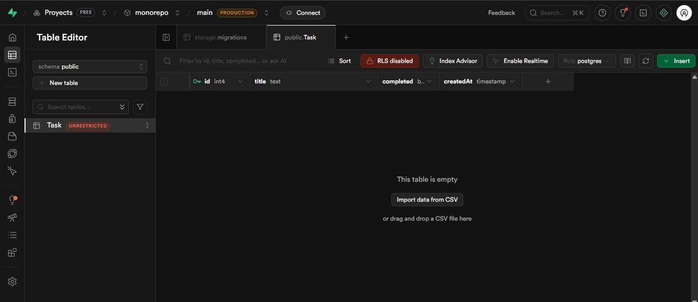

# Monorepo: Checklist / Task Manager App

## Descripción
Este proyecto es una aplicación web tipo **Checklist / Task Manager**, organizada como **monorepo**.  
Cuenta con:

- **Frontend:** Interfaz para listar, crear y eliminar tareas.  
- **Backend:** API REST con Express y Prisma.  
- **Base de datos:** PostgreSQL en Supabase, conectada con Prisma Client.

El frontend se comunica con el backend mediante la API `/tasks`.

---

## URLs de la aplicación

| Servicio | URL |
|----------|-----|
| Frontend | [https://arquitectura-de-sistemas.vercel.app/](https://arquitectura-de-sistemas.vercel.app/) |
| Backend  | [https://arquitectura-de-sistemas.onrender.com](https://arquitectura-de-sistemas.onrender.com) |

---

## Base de datos

Se utilizó Supabase con la tabla `Task`:

| Columna    | Tipo    | Descripción           |
|------------|--------|---------------------|
| id         | Int    | ID autoincremental  |
| title      | String | Título de la tarea  |
| completed  | Boolean| Estado de la tarea  |

Captura de pantalla de la base de datos:

---

## Documentación de la API

La API está documentada con **Swagger / OpenAPI**.  
Puedes acceder a la documentación interactiva en:

[https://arquitectura-de-sistemas.onrender.com/docs](https://arquitectura-de-sistemas.onrender.com/docs)

### Endpoints principales

#### 1. Obtener todas las tareas
- **Método:** GET
- **URL:** `/tasks`
- **Respuesta:** Array de tareas

#### 2. Crear una tarea
- **Método:** POST
- **URL:** `/tasks`
- **Body:** `{ "title": "string" }`
- **Respuesta:** Tarea creada

#### 3. Eliminar una tarea
- **Método:** DELETE
- **URL:** `/tasks/:id`
- **Respuesta:** Mensaje de confirmación